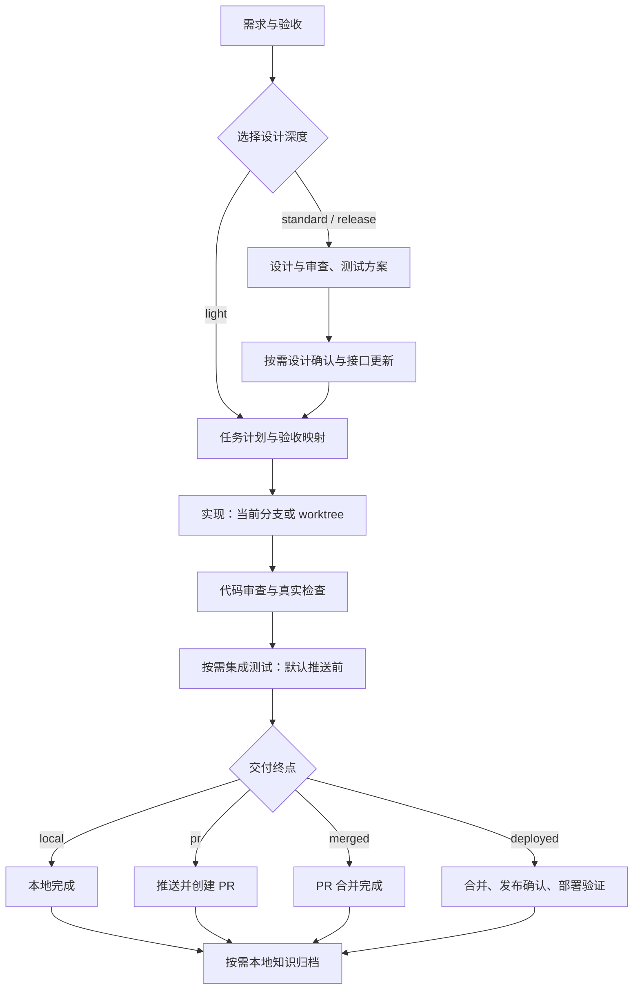

# Harness Devflow

一个按任务规模选择流程的 AI 研发插件：以本地文档、Git 和项目测试命令为基础，完成需求、计划、实现、验证及所需交付。运行时仅依赖 **Python 3.10+ 与 Git**，业务代码可以使用任意语言。当前版本 **0.3.1**。

Skills 指导 Agent 完成研发工作，运行时根据产物、代码版本和检查记录推进阶段。项目通过配置选择流程深度、交付终点、测试命令和外部工具。

## 按任务选择流程

定义 16 个流程阶段，运行时按配置生成实际流程。核心为 **需求 → 计划 → 实现 → 验证**，设计深度、交付终点和隔离方式独立选择。

| 配置 | 默认开发流程 | 默认终点 |
| --- | --- | --- |
| `light` 轻量 | 需求 → 具体任务计划 → 实现 → 审查与验证 | 本地完成 |
| `standard` 标准 | 需求 → 设计 → 设计审查 → 测试设计 → 计划 → 实现 → 审查与验证 | 本地完成 |
| `release` 发布 | 标准流程，增加设计确认 | 部署完成 |

Agent 根据实际任务选择：小修复使用 light，复杂功能使用 standard，需要正式设计确认与部署时使用 release。用户与项目的明确要求优先。轻量流程的需求文档仍包含实现思路、验收标准和验证方法。

| 交付终点 | 验证后的交付阶段 | 何时完成 |
| --- | --- | --- |
| `local` | 无远端阶段 | 本地实现和验证完成 |
| `pr` | 推送 → 创建 PR/MR | PR/MR 已创建，不等合并 |
| `merged` | 推送 → 创建 PR/MR → 跟进 | 已观察到合并，无发布审批 |
| `deployed` | 推送 → PR/MR → 跟进 → 发布确认 → 部署验证 | 批准版本部署成功 |



接口和知识默认关闭；项目配置了集成测试命令时默认启用集成测试。依赖推送后的预览环境时，可将集成测试放到推送后。普通 API 编码可直接纳入实现，仅独立契约更新或代码生成才需要接口阶段。

单模块 `auto` 模式直接使用当前工作分支，多模块使用 worktree；可以显式要求 worktree。设计确认按任务启用，标准流程默认无需额外设计批准。知识可自动归档到本地，也可配置人工确认；没有新增知识时直接结束，不请求批准。

## 16 个 Skills：14 个流程入口＋2 个专业能力

| Skill | 对应阶段 | 作用 |
| --- | --- | --- |
| `flow` | 总入口；按需 `design_approval` | 选择流程、路由、确认具体设计、恢复和重配 |
| `intake` | intake | 调研、范围、模块、验收；轻量方案与验证说明 |
| `design` | design | 按需技术设计 |
| `design-audit` | design_audit | 按需跨模块设计审查 |
| `test-design` | test_design | 按需场景与验收覆盖 |
| `interfaces` | interfaces | 按需独立契约与生成工具更新 |
| `plan` | plan | 具体任务、验收与验证映射、依赖批次 |
| `implement` | implement | 当前分支或 worktree 实现与模块验证 |
| `review` | review | 代码审查、真实检查、修复 |
| `integration-test` | integration | 按需集成／端到端验证 |
| `delivery` | push、pr | 推送及创建 PR/MR |
| `monitor` | monitor | 仅 merged/deployed 终点跟进合并 |
| `release` | release、deploy | 仅 deployed 终点发布确认与部署 |
| `knowledge` | knowledge | 按需本地归档与检索 |
| `brownfield-recon` | intake 的按需调研；也可独立使用 | 存量行为、契约、保留／替换／移除判断及修改前基线 |
| `server-tech-design` | 服务端 design/design_audit；也可独立使用 | 服务端主流程、契约、失败处理、可观测性与上线设计及审查 |

`flow` 按配置处理设计确认，`plan` 记录具体任务及验证方法，模块完成必须对应计划中的任务 ID。配置支持指定阶段启停与集成测试位置，阶段顺序由运行时的依赖关系确定。

## 专业 Skill 接入

两个专业 Skill 及配套脚本、参考文件位于插件的 `skills/` 目录，随插件目录一同提供。调用按插件自身位置解析，默认输出本地 Markdown；一份设计文档可以覆盖多个模块。

| 能力位置 | 自动选择 |
| --- | --- |
| intake 中需要存量调研 | 包内 `brownfield-recon`；已有充分基线的小任务可直接复用 |
| backend 的 design | 包内 `server-tech-design`，编写方案 |
| backend 的 design_audit | 同一专业 Skill 的审查模式，单独记录本次审查与发现 |
| frontend、mixed、generic 的设计 | 内置通用方法，或显式配置项目能力 |
| review | 内置代码审查，或项目提供的专业审查方法；真实检查仍然必需 |

`--domain backend` 指定服务端任务；Agent 应根据实际需求和代码确定类型。`--capability SLOT=PROVIDER` 显式指定能力，`builtin` 强制内置方法。自定义能力放在消费项目的 `.harness/skills/<name>/`，配置保存逻辑名称，不保存机器绝对路径。

阶段入口使用 `prepare-capability` 生成输入请求与源码快照，再由 Agent 执行专业 Skill，使用 `complete-capability` 提交专业产物，最后转换为 Harness 阶段报告。准备能力不代表已执行。内置方法直接提交阶段报告。

已选择的专业调研尚未完成或被阻断时，阶段不能通过；审查发现必须进入最终报告；源码快照与专业产物纳入内容哈希。任务可追溯实际使用的能力、来源摘要和结果。新源码更新不会默默改变当前已准备的调用。

调研采集器可通过 `collect-recon --scope ... --keyword ...` 执行，使用标准输出写入命令日志，也支持直接输出到 Harness 产物目录。它只收集候选证据，不自动判定调研完成。详情见[能力接入契约](references/capabilities.md)。

## 使用方式

获取仓库后，使用完整的 `harness-devflow/` 目录。复制或分享时保留 `.codex-plugin/`、`.claude-plugin/` 等隐藏目录，以及 Skills、运行时和配套资源。

### 在 Codex 中开发试用

插件入口为 `.codex-plugin/plugin.json`，开发时可以直接从源码目录加载 Skill。

可以在任务中直接要求：

> 阅读 `/absolute/path/harness-devflow/skills/flow/SKILL.md`，按该技能在 `/path/to/my-project` 启动开发流程，需求是……

注册到你选择的 Codex 插件市场并安装后，入口为：

```text
$harness-devflow:flow 启动流程，需求是……
$harness-devflow:flow 查看状态并继续
```

市场安装使用当前 Codex 支持的 `codex plugin add harness-devflow@<已配置的市场名>`。
注册/安装属于宿主配置步骤，应在明确选择个人或团队市场后操作；源码开发与 CLI 测试均不需要此步骤。
安装或更新后在新任务中使用，以加载新的技能。推送门禁可通过 Git Hook 启用。

### 在 Claude Code 中试用

```bash
claude --plugin-dir /absolute/path/harness-devflow
```

然后调用 `/harness-devflow:flow`。采用同一组 Skills 和 Python 状态机，仅入口形式不同。
此方式依据 [Claude Code 官方插件文档](https://code.claude.com/docs/en/plugins)。

### 直接运行 CLI

在已有 Git 项目中：

```bash
python3 /absolute/path/harness-devflow/scripts/harness.py --repo /path/to/project init --base main
```

编辑生成的 `.harness/project.json`，填写项目真实的检查命令。参考
[Python 标准配置](examples/python-local.json)、[Python 轻量配置](examples/python-light.json)或 [Node 配置](examples/node-local.json)；示例目录和脚本名必须与实际项目匹配。配置提交后，在干净的需求分支启动：

```bash
python3 /absolute/path/harness-devflow/scripts/harness.py --repo /path/to/project doctor
python3 /absolute/path/harness-devflow/scripts/harness.py --repo /path/to/project --task add-export start --goal '实现服务端导出功能' --base main --profile standard --target local --domain backend
python3 /absolute/path/harness-devflow/scripts/harness.py --repo /path/to/project --task add-export status
python3 /absolute/path/harness-devflow/scripts/harness.py --repo /path/to/project --task add-export resume
```

`start` / `resume` 的 CLI 返回当前状态和下一技能，具体研发工作由 Agent 按技能执行。它不是一个无人值守自动编写任意需求的模型服务。

按需覆盖项目配置，例如 `start ... --profile light --target local`、`start ... --target pr --enable interfaces`。`status` 返回本任务的 `active_stages`。完成本地任务后，若用户要求创建 PR，可以运行：

```bash
python3 /absolute/path/harness-devflow/scripts/harness.py --repo /path/to/project --task add-export configure-flow --target pr --reason '用户要求将已验证的变更提交 PR'
```

重配保留有效的前置证据，并让受影响的阶段重新执行。完整选项见[流程配置](skills/flow/references/profiles.md)。配置不是外部操作授权；缺凭据或测试失败不能当成阶段不适用。

## 运行时保证

- **有证据再推进**：实际文件内容哈希、阶段报告、检查结果共同决定完成；口头“完成”不能改变状态。
- **批准关联产物**：修改已审查文件会使证据失效，需要重开对应阶段。
- **检查关联代码**：记录真实退出码、当前提交和工作区内容；提交变化后旧检查不能复用。
- **中断可恢复**：有界 OS 锁与原子 JSON 写入；历史保留；失败命令和中断进程有明确恢复方式。
- **按需隔离实现**：单模块默认当前分支；worktree 模式逐批验证和合并，下批继承上游实现。
- **重试有界**：默认最多 3 次失败尝试，模块检查并发上限默认 4；达到上限先诊断再显式重开。
- **平台可替换**：命令数组 + JSON 结果适配器，附带可选 Git push 与 GitHub PR/观察适配器。
- **本地知识闭环**：可选归档为独立快照，检索返回路径、行号和是否人工批准，默认不外传。

这些是本地流程约束；拥有本地文件写权限的人仍能改状态，Git Hook 也可以被绕过。组织级强制策略应由 CI 和代码托管平台独立实现。批准人的姓名与外部操作授权备注是审计记录，不是认证系统。

## 测试与验证

```bash
python3 -m unittest discover -s tests -v
python3 scripts/validate_distribution.py
```

测试在临时仓库中运行，隔离用户 Git 全局配置，执行真实提交、worktree、合并、测试命令与本地远程 push。平台接口的测试使用显式假客户端，真实外部服务的认证与生产部署由使用项目负责验收。

v0.2 的配置与任务状态兼容：新增能力字段在读取时补充默认值，不因升级自动重跑已完成阶段；下一次正常状态修改时持久化。v0.1 的活动任务需使用保留的 v0.1 包完成或导出，新版本不会自动改写其状态。

## 文档与扩展

- [流程 Skills 职责与协作](docs/skill-guide.md)：各入口的职责、上游输入和完成条件。
- [运行时与报告契约](skills/flow/references/runtime.md)：CLI、状态、证据格式、恢复与模块执行。
- [流程配置与迁移](skills/flow/references/profiles.md)：三种流程、四种终点、条件阶段与配置优先级。
- [专业能力接入](references/capabilities.md)：随包分发、能力绑定、报告转换、基线与来源记录。
- [适配器契约](references/adapters.md)：接入代码托管、测试系统、接口生成和部署工具。
- [设计说明](docs/architecture.md)：运行时分层、状态恢复与扩展方式。
- [验证记录](docs/validation.md)：实测范围、结果与边界。

默认支持 macOS/Linux 上的本地 Git 工作流；标准库中保留了 Windows 文件锁分支，但尚未对 Windows 和各宿主的完整安装/交互流程做端到端验收。
