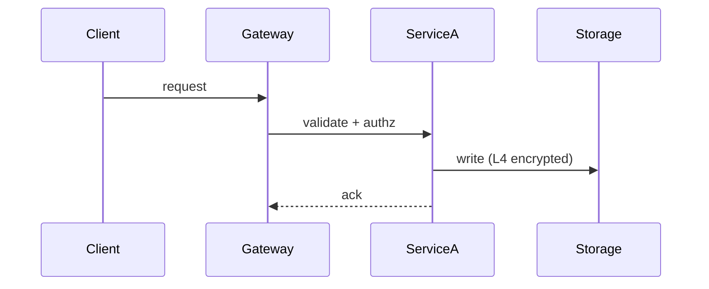

# Writing Style — Making the Design Actually Readable

A technical design is read by tired reviewers, cross-team collaborators, and your future self. The goal
is that a reviewer catches the plan and the risks **in one read**. These are concrete techniques with
before/after examples.

## 1. Lead with the answer

Reviewers scan top-down and stop when they've got the gist. Put the conclusion first, support it after.

**Before**
> We considered a synchronous write, then a message queue, then a dual-write with reconciliation. The
> sync write couples the two services… the MQ adds latency… after weighing these we decided to use the
> dual-write approach with an async reconciliation job.

**After**
> **Decision: dual-write + async reconciliation.** Rationale below (alternatives: sync write, MQ).
> - Sync write — rejected: couples the two services, a downstream outage blocks us.
> - MQ — rejected: adds ~50ms and an extra failure mode.

## 2. One idea per paragraph; keep paragraphs short

If a paragraph runs past ~5 lines, it's usually two ideas. Split it. A wall of text signals to the
reviewer "this will be painful" and they skim past the important part.

## 3. Use tables for anything comparative

Options, interface fields, capacity estimates, traffic/limits — all scan far better as tables than
prose.

**Option comparison**

| Option | Approach | Pros | Cons | Chosen |
|---|---|---|---|---|
| A | Sync write | Simple, strong consistency | Tight coupling, cascading failure | |
| B | Dual-write + reconcile | Decoupled, resilient | Eventual consistency, extra job | ✅ |

**Interface fields**

| Field | Type | Required | Notes |
|---|---|---|---|
| user_id | int64 | yes | |
| safe_bank_card | string | no | encrypted, PR-sensitive naming |

## 4. Draw the flow

Any non-trivial flow, call chain, state machine, or architecture is clearer as a diagram. In Feishu, use
Mermaid/PlantUML code blocks (they render as editable whiteboards); use `lark-whiteboard` for complex
architecture. Never substitute a screenshot or a generated image.

Keep each diagram focused on one thing — a diagram that shows everything shows nothing.

## 5. Number options and state the decision

Never make the reader infer which option won. Number them, then write "**We chose Option 2 because…**".
The rejected options are what reviewers scrutinize — keep them, with the reason for rejection.

## 6. Bold the load-bearing sentences

A reviewer should be able to read only the **bold** text and still catch: the decision, the main risk,
the kill-switch, the compatibility break. Don't bold everything — reserve it for the sentences that
carry the review.

## 7. Quantify

Replace vague claims with numbers wherever you can.

- ✗ "improves performance" → ✓ "P99 800ms → 300ms"
- ✗ "handles more traffic" → ✓ "+200 QPS on lark.facade.chat, limit 2k"
- ✗ "some storage growth" → ✓ "~3M MySQL rows/day, ~20G/day TOS"

## 8. Mark unknowns explicitly

Anything that needs a human decision — a real FG name, a capacity sign-off, a security conclusion —
should be a visible **【待填写】 / TODO**, not silently omitted. A reviewer would rather see an open
question than a hidden gap.

## 9. Right-size

Delete sections that don't apply (and note you deleted them). Padding every section with "N/A" makes
the doc longer and *less* likely to be read. A tight, complete doc beats a long, hedged one.
